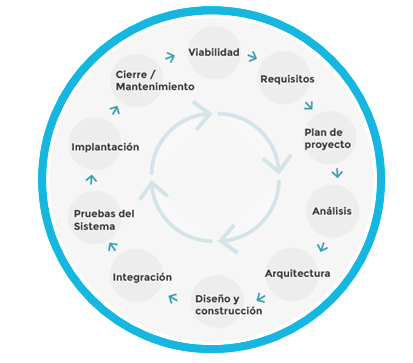

# Ciclo de Vida de la Informática

La informática en el ámbito de las empresas (más grandes) por lo general, está compuesto por las siguientes:

1. Viabilidad: Necesidad de negocio.
2. Requisitos: Se plantean los requisitos por abordar
3. Plan de Proyecto: Planeación de adquisición, integración, etc.
4. Análisis: Análisis de la ejecución.

**Infraestructura del Negocio**

 5. *Arquitectura:* Sustentado por el análisis, se definen los equipos, métodos (respaldo, procesamiento, comunicación.)
 6. *Diseño y Construcción:* Usualmente no existe, sino que forma parte de la integración
 7. *Integración:* Integración de las adquisiciones en la infraestructura.
 8. *Pruebas del Sistema:* Pruebas de la integración con la infraestructura.
 9. *Implantación:* Puesta en marcha de la solución.
10. *Cierre / Mantenimiento.*
11. ***Personas***

**Infraestructura del Negocio**

Se inicia con a *viabilidad y las necesidades* de negocio por solventar un problema. Desde esto inicia el proceso de "como" hacer este proceso de adquisición e integración que es lo que denomina como *plan del proyecto*.

Con el inicio de la parte ejecutoria inicia el *análisis* que impulsa a la *arquitectura*, este último define cuáles son los equipos (respaldo, procesamiento, comunicación a nivel) necesarios.

Una vez se define el equipo por utilizar inicia el *diseño y construcción*, esta a veces no existe sino que se salta a la *integración* (puesto que tecnología que utilizamos se integra al 100% sin problema alguno)

Posterior a la *integración* se necesita realizar *pruebas de sistemas*, *implantación* y *cierre/mantenimiento*

Las últimas 7 forman parte de la **infraestructura** y las primeras 4 forman parte de la **administración**

Aparte de estas 10, en el área de infraestructura, se puede incluir al *ser humano*, que es gracias a quien llega a funcionar la infraestructura como tal.
