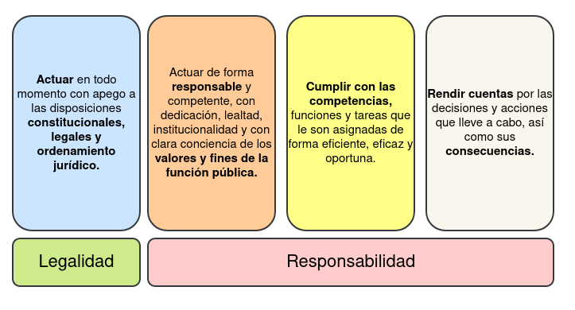
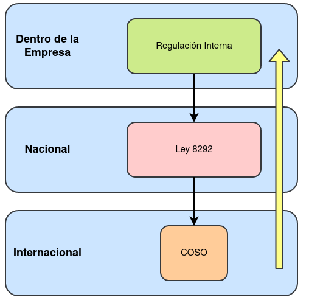

# Control Interno

> Una serie de acciones ejecutadas por la administración activa, diseñadas para proporcionar seguridad en la consecución de los objetivos organizacionales.

Características:

* Proceso dinámico
* Recursos Humano.
* Busca la consecución de los objetivos, que se cumplan los objetivos de la empresa.
* Grado razonable de seguridad.

## Marco Normativo del Control Interno

Control Interno nace a partir de la regulación Internacional **C.O.S.O.**, este es la regulación internacional que define como funciona comúnmente el control interno.

En C.R. se aplica la ley 8292 (obligatorio para el gobierno y que está basado en C.O.S.O.), pero en la empresa privada se pueden optar por C.O.S.O. o la regulación interna.

> Es la regulación Internacional que establece un modelo común de control interno con el cual las empresas y organizaciones pueden evaluar sus **sistemas de control**.

## Ley 8292 para el Control Interno

Corresponde a la topicalización del marco de regulación internacional **COSO** y establece los criterios mínimos para el *establecimiento, funcionamiento y mantenimiento* de los sistemas de control interno.

### Componentes de la Ley 8292

Cuenta con 2 partes o componentes

* **Componente Funcional:** Son 5 componentes que interactúan para alcanzar los objetivos corporativos.
  * Ambiente de Control.
  * Valoración del Riesgo.
  * Actividades de Control.
  * Sistemas de Información.
  * Seguimiento.
* **Componente Orgánico:** Compuesto por la administración y por la Auditoría.
  * ***Administración Activa:*** Jerarquía de la empresa.
  * ***Auditoria:*** Auditores que trabajan dentro de la institución.

### Roles y Responsabilidades

La ley 8292 indica que la responsabilidad del sistema de control recae sobre el componente Funcional o sea la jerarquía empresarial

* **Establecer** un sistema de control interno.
* **Perfeccionar** el sistema de control interno.
* **Evaluar** el sistema de control interno.
* **Mantener** el sistema de control interno.

#### Principios

Debido a que la ley 8292 es generalmente aplicada en entidades públicas dentro de C.R., existen otras leyes que deben ser cumplidas por los funcionarios públicos, la Ley General de Administración Pública (Ley 6227) define dos principios.

## Regulación Interna

Todo aquello a nivel documental que se genera dentro de una institución que complementa a la legislación y normativa externa de control interno. Digamos que explica bajo que condiciones aplicar *x* normativa.

**Ejemplos**

* Manual para la Administración Integral del Riesgo.
* Marco para la gestión de Riesgos Operativos.
* **Marco Interno** de la Gestión del Sistema de Control Interno

## Como Aplicar el Control Interno

Según el contexto, se podría ver de la siguiente manera.

## Ambiente de Control

> Conjunto de factores del ambiente organizaciónal que deben de ser establecidos y respetados por todos los niveles organizacionales.

Se encuentran los siguientes elementos:

* **Ética:** Comportamiento ético de la institución.
* **Compromiso Superior:** Compromiso por parte del jerarca con sus subordinados.
* **Estructura:** Asociación de la estructura con las necesidades y dinámica institucional.
* **Gestión del Personal:** Acciones para desarrollar el compromiso y la competencia de los miembros de la organización.

## Valoración del Riesgo

Encontramos los siguientes conceptos clave a la hora de valorar los riesgos:

* **Riesgo:** Posibilidad de pérdidas económicas debido a eventos adversos.
* **Riesgo Operativo:** Pérdida potencial que se puede producir por fallas o deficiencias organizacionales o incluso acontecimientos externos.
* **Materialización de un Riesgo:** Posibilidad de que riesgo se vuelva realidad.

Comprender el riesgo como una amenaza es la forma más simple para identificarlo, estas pueden ser tanto internas como externos y puede materializarse en cualquier momento. Estas pueden causar perdidas monetarias o impedimentos para alcanzar los objetivos empresariales.

Estos pueden identificados o mapeados mediante una matriz de riesgos.

| Dominio                         | Aspecto Evaluado                               | Riesgos                                                                                                                 | Control Mitigador                                                                                                                                                                                                           |
| ----                            | -----                                          | ----                                                                                                                    | ----                                                                                                                                                                                                                        |
| Seguridad de Telecomunicaciones | Gestion de la seguridad en las redes           | Afetación del servicio, perdida de ancho de banda por conexión indebida de empleados                                    | Instruir a los empleados que la red BN-WIFI es de uso exclusivo para los clientes del BNCR                                                                                                                                  |
| Seguridad de Telecomunicaciones | Gestion de la seguriddad en las redes          | Lentitud en el servicio por mensajes que consumen mucho ancho de banda de otros servicos                                | Definir formato, tamaño máximo y horario de servicio para no competir con servicios bancarios. Además se debe considerar la utilización y existencia de canales alternativos o redundantes para la transmisión de mensajes. |
| Seguridad de Telecomunicaciones | Intercambio de información con partes externas | Perdidas por fallas en las comunicaciones entre los equipos del proveedor y los del Banco y no poder atender al cliente | Establecer procedimientos y protocolos de actuación para el tratamiento de fallas en las líneas de comunicación                                                                                                             |

### Actividades de Control

Una vez se han identificado a aquellos riesgos que plagan a la empresa o proyecto es necesario establecer actividades que disminuyan su probabilidad de materialización, así mantenerlos **controlados y administrados**.

Esto se logra mediante *políticas y procedimientos* que aseguran que son implementados estos controles emitidos por los mandos superiores para el cumplimiento de los objetivos del control interno.

| Código | Actividad de Control                                                                                                                                                                                                                                                    | Responsable              | Riego                                                                                                                                                                                 |
| ---    | ---                                                                                                                                                                                                                                                                     | ---                      | ---                                                                                                                                                                                   |
| SI-01  | Asegurar la eliminación de todos los acceso y privilegios de usuario, así como la solicitud de carné, llaves, tarjetas de acceso, artículos o dispositivos de aquellos funcionarios con medidas cautelares o que hayan terminado su contrato laboral con al institución | Jegaturas y Supervisores | Disminución de los recursos financieros debido a pérdidas o estafas por usos malintencionados de los recursos informáticos o compromiso de la información por parte de exfuncionarios |
| SI-02  | Gestionar la inactivación de usuarios que se ausentes por más de 5 días hábiles (vacaciones, permisos temporales, incapacidades)                                                                                                                                        | Supervisores             | Pérdidas o estagas por usos malintencionados de los recursos informáticos de la institución por parte de usuarios fuera de su jornada de trabajo                                      |

#### Requisitos de una Actividad de Control

* **Integración:** Debe de aplicarse en las operaciones diarias de la empresa.
* **Respuesta a riesgos**: Congruentes con los riesgos identificados, o sea se encuentran relacionados con un riesgo identificado y su propósito es mitigarlo.
* **Viabilidad:** El beneficio de implementarlo debe de ser mayor al costo de implementación.
* **Documentación:** Debe de documentarse todos los elementos relacionados con esta actividad de control, como serian los procesos procedimientos, descriptores de puestos, listados de control y acciones de supervisión.
* **Divulgación:** Debe ser de conocimiento general de todos los colaboradores.

## Sistemas Información dentro del control interno

Hace referencia a la **gestión de la información**, tanto física como electrónica. Incluye la *Calidad de la Información* y la *Comunicación de la Información*

### Calidad de la Información

Basado en la *Ley 8292* se refiere a los siguientes 3 conceptos clave:

* **Confiabilidad:**
  * La información debe ser confiable y con fuentes fiables.
  * Debe de encontrarse libre de errores, defectos, omisiones y sobre todo modificaciones.
* **Oportunidad:** Debe de ser recopilada, generada y procesada en el tiempo y momento adecuado.
* **Utilidad:** La información debe de ser útil para el usuario.

### Comunicación de la Información

Se refiere a los siguientes 3 conceptos:

* **Canales y Medios de comunicación:** Que los canales y medios de comunicación se encuentren disponibles.
* **Destinario y Oportunidad:** La información debe de ser transmitida hacia su destinario de forma oportuna.
* **Seguridad:** La información debe de ser almacenada y trasladada de forma segura, que garantice su disponibilidad y acceso.

#### Seguridad de la información

Compuesto por 3 pilares:

* Disponibilidad.
* Integridad.
* Confidencialidad.

## Seguimiento

Son las actividades para valorar la calidad del funcionamiento del control interno a lo largo del tiempo, así asegurando los hallazgos del proceso de auditoria y otras revisiones.

De esta manera permite identificar desviaciones en el control interno, con la finalidad de que aplique acciones preventivas o correctivas dependiendo de la importancia y los riesgos asociados.

Se encuentra el siguiente ciclo de seguimiento:

* **Seguimiento continuo:** Aquel seguimiento realizado por los colaboradores de forma diaria, en el supuesto del cumplimiento de las políticas y procedimientos establecidos en el control interno.
* **Seguimiento Periódico:** Las autoevaluaciones que deben de ser realizadas por las dependencias periódicamente, para verificar el cumplimiento, validez y suficiencia del control interno
* **Seguimiento Periódico:** Los resultados de estas evaluaciones deben de ser comunicados con las instancias adecuadas para la toma de decisiones y seguimiento adecuado.
* **Seguimiento Continuo:** Cuando el colaborador determina desviaciones y las comunica con las entidades correspondientes.

## NIA 400

Su objetivo corresponde a establecer normas y proporcionar lineamientos para poder comprender los sistemas de contabilidad y de control interno sobre los riesgos de auditoría. Engloba los siguientes aspectos:

* Sistemas de Contabilidad.
* Ambiente de control.
* Procedimientos de control.
* Riesgos de control.

## Gobierno

Cumplimiento de regulaciones, leyes, políticas internas y requisitos contractuales para mejorar la rentabilidad, eficiencia y el crecimiento corporativo.

### Gobierno Corporativo

Conjunto de normas, principios y procedimientos que regulan la **estructura y el funcionamiento de los órganos de gobierno de una empresa**. Regular todas las áreas de la empresa a lo interno, debe existir un alineamiento de TI con el gobierno corporativo:

* Toma de decisiones que tienen que ver con la dirección estratégica general de la empresa y sus políticas corporativas.
* Los mecanismos de control sobre el correcto desempeño de la dirección ejecutiva y la implementación del plan estratégico,
* Cumplimiento normativo, establecimiento de políticas y procedimientos adecuados para garantizar el cumplimiento normativo.
* Las relaciones entre los principales órganos de gobierno de la compañía, así como los derechos y deberes de cada uno de ellos: consejo de administración, junta directiva y accionistas.

### Gobierno de TI

Órgano de **alto (mayor) nivel**, tomador de decisiones cuyo rol principal es la evaluación, dirección y supervisión de las **tecnologías de información**. Esto significa que no se sale de su área especifica, Incluye:

* El uso adecuado de su propia inversión.
* Seguimiento a los objetivos estratégicos de TI.
* La prestación de servicios a las demás áreas de negocio.
* Entrega de valor y garantía respecto a los servicios que brinda TI.
* Alineamientos entre los objetivos estratégicos de TI y el negocio.

## Reglamento SUGEF 14-17

Lineamientos generales sobre la estructura del gobierno de TI y el perfil tecnológico. Define 6 lineamientos:

* Responsabilidad: Todos deben de tener encuentra las capacidades actuales y futuras de las TI.
* Adquisiciones: Las adquisiciones de TI se realizan con razones válidas, basándose en un análisis profundo y continuo. Debe de haber un balance entre los beneficios, oportunidades, costos y riesgos tanto a corto como a largo plazo.
* Rendimiento: La TI está dimensionada para dar soporte a la organización, proporcionando servicios con la calidad adecuada para cumplir con sus necesidades.
* Conformidad: La función de TI cumple con todas las legislaciones y normas aplicables.
* Conducta Humana: Las políticas de TI, prácticas y decisiones muestran respeto por la conducta humana, incluyendo las necesidades actuales y emergentes de toda persona involucrada.

**Actividades:**

* Monitorizar.
* Evaluar.
* Dirigir.
