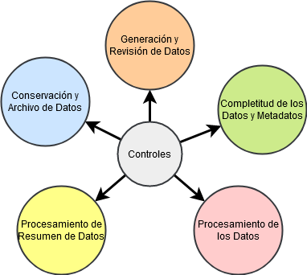

# Integridad de Datos

Implica que la información sea integra, completa, exacta, que eventualmente sea homonea, coherente y contribuye a la toma de desiciones. Claramente para esto se tiene que buscar que esta cumpla el objetivo para el cual fue consevida, con las entradas y salidas se cumple su objetivo o proposito

Se busca que no hayan datos incorrectos, alterados, faltantes ni duplicados, estos problemas se dan mucho cuando la información es compartida digamos entre data warehouses, donde se generan problemas al trasladar o migrar los datos se pierde la integridad y es algo que el auditor debe de validar.

Requiere de métodos y prácticas para evaluar los siguientes elementos:

* Dispositivos.
* Software.
* Infraestructura.
* Procesos.
* Procedimientos.
* Usuarios.

## Revisión de la Integridad

Se cuenta con marcos para esto como el *ALCOA* que:

> Busca dar garantia a los datos que se registran en una base de datos.

Busca asegurar las siguientes características sobre los datos:

* **A**tribuible: quien ejecuto la tarea y cuando lo hizo.
* **L**egible: Posibilidad de poder leer un archivo de la fuente de datos y sus entradas.
* **C**ontemporáneo: Que los datos sean documentados, en el momento que se ejecuta el proceso o actividad original.
* **O**riginal: Copia original, datos observados o copia certificada, asegurar que los datos no se han visto alterados, ajustados o procesados.
* **A**ccurate: Que el dato no se ha visto modificado (digamos ajustes o correcciones sin documentar) y que sea real.

### Que otros Elementos tener en Cuenta

* ¿Cómo se revisan los datos?
* ¿Están completos todos los datos y meta datos?: Importante para la hora de hacer consultas y encontrar los datos tal como son, sin ningún tipo de errores o faltas.
* ¿Cómo se procesan los datos?: Se asegura que no se modifiquen, dupliquen ni se falsifiquen.
* ¿Quién genera y revisa los datos?: Niveles de acceso, responsabilidades y segregación de funciones.
* ¿Cómo se resumen los datos?: ¿Cómo se reportan los resultados?, se asegura que se reportan datos relevantes.
* ¿Cómo se validan todos los procesos e interfaces?: ¿Cómo se valida la entrada, procesamiento y salida de datos?
* ¿Cómo se observan y archivan los datos?: Se pregunta: ¿Qué se conserva, cómo se conserva y dónde se va a custodiar?

### Aseguramiento de la Calidad

Se tienen los siguientes elementos para asegurar la calidad.

* Revisar los procedimientos operativos estándar.
* Identificar etapas críticas.
* Revisar o crear diagramas de flujo y mapas de procesos.
* Identificar interfaces críticas.
* Identificar documentación crítica,
* Revisar los hallazgos precios de nuestra auditoría o de inspecciones anteriores.
* Realizar la validación basada en un análisis de riesgos.
* Asegurar la seguridad de la información: Identificación de usuarios, roles, permisos, segregación de actividad. Se asegura que un dato no puede ser alterada por cualquier usuario.

#### ¿Cómo mantener la integridad de los datos.?

* Asegurar la calidad y robustez de los datos en los sistemas.
  * Mediante un registro de todos los datos críticos de un sistema.
  * [Continuidad de la Operación](Continuidad_de_la_Operación.md) que asegure la continuidad de la operación.
  * Selección de sistemas y proveedores que cumplan con las regulaciones vigentes.
  * Realizar copias de seguridad, resguardarlas en una ubicación segura y verificar la recuperación de todos los datos.

