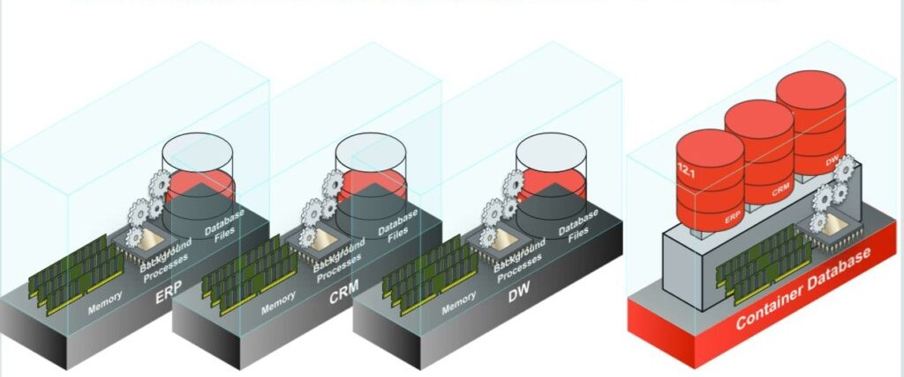

# Oracle Multitenant

Esta es una arquitectura introducida con Oracle 12c, con la meta de consolidar y simplificar la administración. Permite multiples insertar multiples "sub-databases" dentro de una "super-database" así proporciona mecanismos rápidos y eficiente de:

* Aprovisionamiento.
* Clonado.
* Backup.
* Protección frente a desastres, ya que esta se hace desde el contenedor y se propaga hacia las bases de datos dentro de este.
* Aplicación de parches.
* Actualización de versión.
* etc.

Con una architectura tradicional de servidores dedicados, la instancia o instancias consumen cada una los recursos de memoria necesarios para operar, por ejemplo cada una cuenta con un SGA por aparte, causando que los recursos del sistemas estén fluctuando según la utilización de recursos de cada instancia. Por otro lado con `Multitenant` se cuenta con **un solo SGA** que administra todos los recursos,



Acá todo esta dentro del mismo contenedor, con una única memoria, los mismos procesos de fondo para todas las bases de datos y cada base de datos contiene a sus propios archivos. Con esto se espera reducir la carga sobre el servidor para hacerlo mas eficiente respecto a lecturas y procesamiento.

Acá encontraremos dos conceptos clave:

1. **El CDB o Container Database:** Este es el contenedor de las bases de datos, se puede decir que es la raíz en donde se insertan hasta 256 bases de datos, al actualizarlo todas las PDBs insertadas recibirán el parche. 
2. **Los PDBs o Plugable Database:** Estas son las sub-bases de datos, se les llama `Pluggable Databases`, puesto que pueden ser insertadas o removidas como sea necesario. En estas sub-bases de datos se crean usuarios y sus objetos correspondientes, 


*Nota:* En el `CDB` no se deberían de crear usuarios, sino en sus sub-bases de datos correspondientes, debido a que el contenedor no puede contener tablas.
*Nota:* Para acceder a cada una de estas `PDBs` se debe de configurar el servicio `tnsnames` con registros de cada una.

## Pluggabble Databases en Detalle

Al trabajar con `PDBs` se cuentan con las siguientes consideraciones.

* Las `PDB` son compatibles con architecturas `no-CDB` o sea se puede usar como una base de datos regular (Aunque la opción de trabajar con una arquitectura tradicional ha sido removido en versiones recientes).
* Los aplicativos no requieren modificaciones para trabajar con una arquitectura  `Multitenant`, a no ser que quiera trabajar específicamente con uno de estos. 
* Adicionalmente un `CDB` cuenta por predeterminado con una PDB oculta a las aplicaciones que actúa de plantilla o un "template" llamada `PDB$SEED`.

Acá las `PDB` comparten `SGA` y procesos de fondo y puede compartir o contar con estructuras físicas individuales. Sobre usuarios se cuenta con usuarios comunes que se encuentran en el root y que pueden administrar a cada `PDB` individual, los usuarios locales son propiedad de una `PDB` individual.

Podemos ver las `PDBs` en nuestra base de datos con la siguiente consulta.

```sql
show pdbs;

CON_ID CON_NAME  OPEN MODE  RESTRICTED
------ --------- ---- ----- ----------
2      PDB$SEED  READ ONLY  NO
3      EXPDB1    READ WRITE NO
```

Acá se cuenta con una única `PDB` en este contenedor, si verificamos los usuarios existentes en el `CDB` y comparamos el resultado de la misma consulta con un `PDB` veremos que este cuenta con una salida distinta.

Veamos un poco de información sobre nuestras `PDBs` con la vista `v$containers`.

```sql
SELECT name FROM v$containers;

NAME
--------------------
CDB$ROOT
PDB$SEED
XEPDB1 <-- PDB
```

Para entonces entrar a un contenedor usamos el siguiente commando.

```sql
ALTER SESSION SET container = XEPDB1;
```

Ahora nos encontramos dentro de este `PDB` llamado `XEPDB1`, para ingresar directamente hacia uno de estos `PDBs` podemos conectarnos normalmente como lo hacemos desde SQLPlus pero con una sintaxis distinta.

```
conn user/password@//ip/pdb
```

Esto puede ser un poco tedioso por lo cual podemos modificar el servicio de `tnsnames` con el archivo `tnsnames.ora`, este suele estar en la siguiente ruta.

```
product/<ver>/<DBHome>/admin/tnsnames.ora
```

Acá entonces podemos agregar nuestros propios registros para cada `PDB` con el siguiente formato

```
<PDB_NAME> =
    (DESCRIPTION =
        (ADDRESS = (PROTOCOL = <PROTOCOL>) (HOST = <HOST>) (PORT = <PORT>))
        (CONNECT_DATA =
            (SERVER = <TYPE>)
            (SERVICE_NAME = <SERVICE>)
        )
            
    )
```

Entonces se tiene el siguiente registro para nuestro `PDB`

```
XEPDB1 =
    (DESCRIPTION =
        (ADDRESS = (PROTOCOL = TCP) (HOST = localhost) (PORT = 1522))
        (CONNECT_DATA =
            (SERVER = DEDICATED)
            (SERVICE_NAME = XE)
        )
    )
```

Entonces nos podemos conectar de la siguiente manera desde SQLPlus

```
conn uh@xepdb1
```

### Estructuras Dinámicas

Con esta nueva arquitectura se tienen las siguientes consideraciones al trabajar con procesos de fondo y estructuras de memoria.

* Se comparte SGA y procesos de fondo como el `Database Writter Process` (DBWR) y `Log Writter Process` (LGWR).
* Agregar nuevas `PDBs` requiere un menor consumo de recursos comparado con una arquitectura tradicional, para que no se crear procesos y estructuras ya existentes en otra instancia de Oracle.

Aun así no todas las estructuras físicas son compartidas.


Igualmente encontraremos usuarios compartidos y únicos.


### Mover PDBs

El movimiento de `PDB` entre contenedores, consiste en mover los meta datos y opcionalmente los `datafiles`, casi como sacar una llave USB. Para sacar una base de datos se usa el siguiente comando.

```sql
ALTER PLUGABLE DATABASE my_pdb UNPLUG INTO '/oradata/hcm.xml';
```

Para conectar esta base de datos a otro `CDB` se utiliza el siguiente comando.

```sql
CREATE PLUGABLE database my_pdb USING '/oradata/hcm.xml';
```

El tiempo de aprovisionamiento de una PDB es extremadamente rápido comparado con una arquitectura tradicional.


