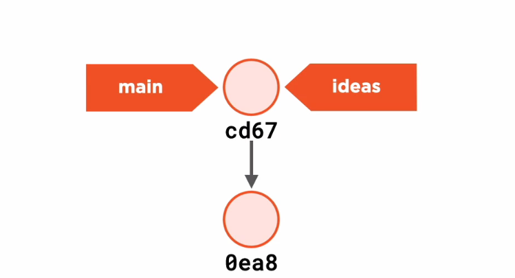
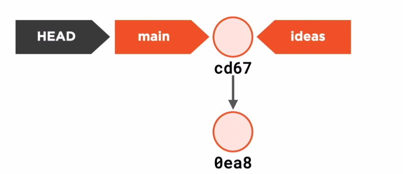
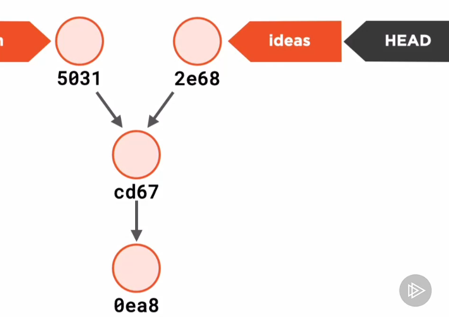
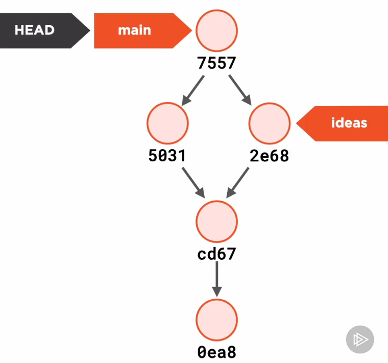
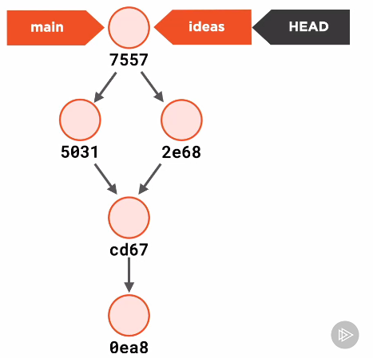

# Branches Demystified

We said Git is a Revision Control System, this is where changes and merges come into play.

## What Branches Really Area

If we visit our recipes project and use `git branches` we will be shown a list of branches as an output. Let's look at the `.git` directory to figure out how branches are made, in here we will find a directory named `refs` which holds a subdirectory `heads`.

```
.
├── heads
│   └── master
└── tags

2 directories, 1 file
```

The `master` file is simply a hash code which is not compresed as a `blob`. This hash is the hash of the _current_ commit.

```sh
git log
commit b130b95f38316df691ce2b457d0c2e93c2cf1a6f (HEAD -> master)
Author: Je12emy <Jeremyzelaya@hotmail.es>
Date:   Mon Aug 9 16:24:23 2021 -0600

    Updated menu.txt

cat heads/master
b130b95f38316df691ce2b457d0c2e93c2cf1a6f
```

If so let's say is just a pointer to a commit.

> A branch is just a reference to a commit.

Creating a new branch is pretty simple.

```
git branch ideas
```

This means a new file is created in the `heads` directory and in this case with the same exact hash code which points towards the same commit.

```
git branch
  ideas
* master

.
├── heads
│   ├── ideas
│   └── master
└── tags

2 directories, 2 files

git log
commit b130b95f38316df691ce2b457d0c2e93c2cf1a6f (HEAD -> master, ideas)
Author: Je12emy <Jeremyzelaya@hotmail.es>
Date:   Mon Aug 9 16:24:23 2021 -0600

    Updated menu.txt

commit dc8d2aa233e2fbc57259ef9358220c336c5ed3b1
Author: Je12emy <Jeremyzelaya@hotmail.es>
Date:   Mon Aug 9 15:28:22 2021 -0600

    First commit

cat heads/ideas
b130b95f38316df691ce2b457d0c2e93c2cf1a6f
```

So this would look like this.



# The Machanics of the Current Branch

Currently when we display the project's branches, we will see the main branch is marked as the current branch.

```
git branch
  ideas
* master
```

How does Git know this is the branch we are working on? Let's check the `.git` directory. In the file `HEAD` which holds a reference to another file.

```
cat HEAD
ref: refs/heads/master
```

> HEAD is just a reference to a branch.

We end up like so in the last diagram we saw.



If we where to modify a file inside our `master` branch and commit it, the `HEAD` would follow along the commit.

```
git log
commit 7743c553be78149d03f25a9281f4787a033cff23 (HEAD -> master) <-- Head is now here
Author: Je12emy <Jeremyzelaya@hotmail.es>
Date:   Wed Aug 11 12:07:10 2021 -0600

    Added new ingredients list 

commit b130b95f38316df691ce2b457d0c2e93c2cf1a6f (ideas) <-- ideas is still pointing here
Author: Je12emy <Jeremyzelaya@hotmail.es>
Date:   Mon Aug 9 16:24:23 2021 -0600

    Updated menu.txt

commit dc8d2aa233e2fbc57259ef9358220c336c5ed3b1
Author: Je12emy <Jeremyzelaya@hotmail.es>
Date:   Mon Aug 9 15:28:22 2021 -0600

    First commit
```

This means the `ideas` branch is still pointing at the previous commit, let's now switch into the `ideas` branch and make some changes.


```
git switch ideas
```

This means the `HEAD` now points towards this branch, it was moved.

```
git log
commit b130b95f38316df691ce2b457d0c2e93c2cf1a6f (HEAD -> ideas)
Author: Je12emy <Jeremyzelaya@hotmail.es>
Date:   Mon Aug 9 16:24:23 2021 -0600

    Updated menu.txt

commit dc8d2aa233e2fbc57259ef9358220c336c5ed3b1
Author: Je12emy <Jeremyzelaya@hotmail.es>
Date:   Mon Aug 9 15:28:22 2021 -0600

    First commit
```

Our working directory now has the contents of this commit. Let's make some slight modifications.

```
git log
commit c023b154883d371d06e4404fc81b51cf7fdb42e1 (HEAD -> ideas)
Author: Je12emy <Jeremyzelaya@hotmail.es>
Date:   Wed Aug 11 12:31:39 2021 -0600

    Tweaked the apple pie recipe

commit b130b95f38316df691ce2b457d0c2e93c2cf1a6f
Author: Je12emy <Jeremyzelaya@hotmail.es>
Date:   Mon Aug 9 16:24:23 2021 -0600

    Updated menu.txt

commit dc8d2aa233e2fbc57259ef9358220c336c5ed3b1
Author: Je12emy <Jeremyzelaya@hotmail.es>
Date:   Mon Aug 9 15:28:22 2021 -0600

    First commit
```

We end up with the following diagram, for both branches.



## Let's Merge

Let's merge both branches on the `main` branch with the following command.

```
git merge
```

This will cause a conflict between both branches since the same line is modified by both branches and Git doesn't know how to deal with this. In here we have the option to select which changes we want to keep or just modify this in a way where both are present. In this case let's just change the amount of apples needed.

```
cat apple_pie.txt
Apple Pie

pre-made pastry
1/2 cup butter
3 tablespoons flour
1 cup sugar
1 tablespoon cinnamon
9 granny Smith apples
```

Now we need to stage this file, and commit it with `git merge`. A commit message is automaticaly made by Git, though we could change it.

```
git log
commit 6d636070c2642dfb821a6bf24173578b6293258d (HEAD -> master) <-- Merge Here
Merge: 7743c55 c023b15
Author: Je12emy <Jeremyzelaya@hotmail.es>
Date:   Wed Aug 11 12:42:57 2021 -0600

    Merge branch 'ideas'

commit c023b154883d371d06e4404fc81b51cf7fdb42e1 (ideas)
Author: Je12emy <Jeremyzelaya@hotmail.es>
Date:   Wed Aug 11 12:31:39 2021 -0600

    Tweaked the apple pie recipe
    
    
```

If we check the log and `git cat-file` the hash something interesting is shown.

```
git cat-file 6d636 -p
tree 4dbf6dae3f7f300f6e531b525642a70dc5fec644
parent 7743c553be78149d03f25a9281f4787a033cff23
parent c023b154883d371d06e4404fc81b51cf7fdb42e1
author Je12emy <Jeremyzelaya@hotmail.es> 1628707377 -0600
committer Je12emy <Jeremyzelaya@hotmail.es> 1628707377 -0600

Merge branch 'ideas'
```

This commit has two parents, this means the branches where merged, in this case into the master branch. This is how it looks in the diagram now.



## Time Travel for Developers

References between comits are used to track version historym when we move into another comit Git doesn't care about history only the trees and blobs which are referenced by this commit. Though merge commit seem more complicated, they just contains reference the trees and blobs for a project state.

> Git's content management is simpler than it looks.

Focus on how commits are linked to each other.

> Git doesn't care about your working directory

Git only cares about the objects in the `Object Database`, which are swithced when we move between branches.

## Merging Without Mergin

If we decide the Apple Pie recipe in main should be oficial recipe for other branches we could now merge it into the ideas branch and keep working from there, in this special cases Git is able to guarantee a merge with no conflicts since they where already solved in the previous merge. This doesn't create a new commit but rather a `fast-forward` which is a way in which Git tells us it saved up creating new objects.

```
git merge master
Updating c023b15..6d63607
Fast-forward
 recipes/apple_pie.txt | 2 +-
 1 file changed, 1 insertion(+), 1 deletion(-)
```

The ideas branch and the master branch are now located in the `HEAD`.

```
commit 6d636070c2642dfb821a6bf24173578b6293258d (HEAD -> ideas, master)
Merge: 7743c55 c023b15
Author: Je12emy <Jeremyzelaya@hotmail.es>
Date:   Wed Aug 11 12:42:57 2021 -0600

    Merge branch 'ideas'
```
This is how it looks in the diagram.



# Losing your HEAD

There is a feature in Git named Detached Head, this is where we are not working in a branch and we checkout into a commit. This is usefull when working with experimental features in our code, to work in a detached head mode let's define onto which commit we should checkout.

```
git log
commit 6d636070c2642dfb821a6bf24173578b6293258d (HEAD -> ideas, master)
Merge: 7743c55 c023b15
Author: Je12emy <Jeremyzelaya@hotmail.es>
Date:   Wed Aug 11 12:42:57 2021 -0600

    Merge branch 'ideas'
```

Let's checkout into this commit.

```
git checkout 6d636070c2
Note: switching to '6d636070c2'.

You are in 'detached HEAD' state. You can look around, make experimental
changes and commit them, and you can discard any commits you make in this
state without impacting any branches by switching back to a branch.

If you want to create a new branch to retain commits you create, you may
do so (now or later) by using -c with the switch command. Example:

  git switch -c <new-branch-name>

Or undo this operation with:

  git switch -

Turn off this advice by setting config variable advice.detachedHead to false

HEAD is now at 6d63607 Merge branch 'ideas'
```

If we check the `HEAD` file we will see it is not pointing to a branch but rather a commit.

```
cat .git/HEAD
6d636070c2642dfb821a6bf24173578b6293258d
```
Let's make some changes in our Apple Pie recipe and check the log.

```
git log
commit 9900c1bd46144d014e60231bff186e658e8adf28 (HEAD)
Author: Je12emy <Jeremyzelaya@hotmail.es>
Date:   Wed Aug 11 14:22:31 2021 -0600

    Removed sugar

commit 6d636070c2642dfb821a6bf24173578b6293258d (master, ideas)
Merge: 7743c55 c023b15
Author: Je12emy <Jeremyzelaya@hotmail.es>
Date:   Wed Aug 11 12:42:57 2021 -0600

    Merge branch 'ideas'
```

We can jump back into a branch and this changes would be enreachable unless we now it's hash code, eventually just as most programming languages a garbage collector will remove changes in detached heads too free up space.

```
git checkout master
Warning: you are leaving 1 commit behind, not connected to
any of your branches:

  9900c1b Removed sugar

If you want to keep it by creating a new branch, this may be a good time
to do so with:

 git branch <new-branch-name> 9900c1b

Switched to branch 'master'
```

To avoid losing this changes we could move them into their own branch by creating a branch from this detached head.

```
git branch notgood
```

And if we check it's log, we will find the changes we made in the detached head.

```
git switch notgood
Switched to branch 'notgood'
```


```
git log
commit 9900c1bd46144d014e60231bff186e658e8adf28 (HEAD -> notgood)
Author: Je12emy <Jeremyzelaya@hotmail.es>
Date:   Wed Aug 11 14:22:31 2021 -0600

    Removed sugar

commit 6d636070c2642dfb821a6bf24173578b6293258d (master, ideas)
Merge: 7743c55 c023b15
Author: Je12emy <Jeremyzelaya@hotmail.es>
Date:   Wed Aug 11 12:42:57 2021 -0600

    Merge branch 'ideas'
```

## Expanding the Git Model

We expanded our Git model, it is composed of:
* Commits.
* Trees.
* Blobs.
* Anotated Tags.
* Head.
* Branches.

There are 3 basic rules here:

* The current branch tracks new commits.
* When you move to another commit, Git updates your working directory with the `Object Model`
* Unreachable objects are garbage collected.
