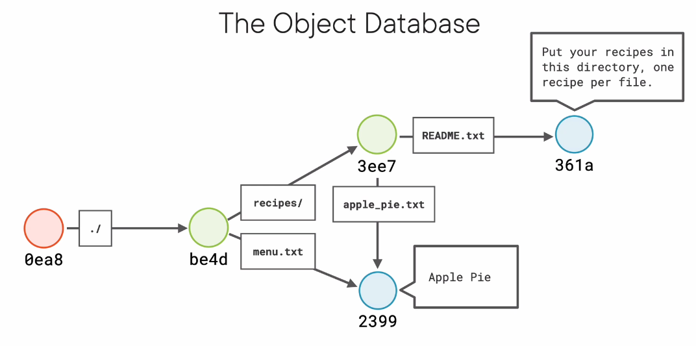

# Git is Not What you Think

## Introduction

Git is not just composed of high level "Porcelain Commands" like `git add`, `git commit`, `git push` and `git branch` and low level "Plumbing Commands" like `git cat-file`, `git hash-file` and`git count-object`. Understanding all of this commands may be hard but we should focus on learning the model, this will remove the complexity from all this commands.

## Git is an Onion

Git is layered like an onion, let's go through each layer to understand what Git really is.

-   Git is a Distributed Revision Control System.
-   Git is a Revision Control System.
-   Git is a Stupid Content Tracker.
-   Git is a Persistent Map, which maps keys to values.

## Values and Hashes

We just said that Git is a "map", that means that is is a table with keys and values. A value can be any sequence of bytes, this could be the content of a text file or a binary file. We give this values to Git and it will calculate a key... a hash, these hashes are calculated with `SHA1 Hash` and every content has it's own hash.

| Hash Value                               | Value     |
| ---------------------------------------- | --------- |
| 23991897e13e47ed0adb91a0082c31c82fe0cbe5 | Apple Pie |

In here the hash is made up of 20 bytes in Hex format, this will be git's key to store content in the map. We can hash a object using a "Plumbing Command".

```sh
echo "Apple Pie" | git hash-object --stdin
23991897e13e47ed0adb91a0082c31c82fe0cbe5
```

This hash is unique and any change will generate a brand new hash value, this also means that if we hash the same string, the same hash will be generated. 

> Every object in Git has its own SHA1

Hash keys could collide and cause data loss, but this is a very low posibility. This hashes are not just unique in our PC, but in pretty much the whole world.

## Storing Things

Git is not just a map, it's a "persistent" map. Let's see what this means by using the last command for hashing a object.

```sh
echo "Apple Pie" | git hash-object --stdin -w
```

We need to run this command inside a Git repository, let's start a new repository.

```sh
git init
git branch -m main
```

When we create a new repository, a new hidden directory `.git` is created, let's explore it. Inside we will find the directory named `objects`, this is known as the `Object Database`, this is the place where Git stores objects. 

```
.git/objects/
├── 23
│   └── 991897e13e47ed0adb91a0082c31c82fe0cbe5
├── info
└── pack

3 directories, 1 file
```

If we look closely (ignore the `info` and `pack` directory for now), we will see a subdirectory with the first two digits of the hash key we generated and the name of the file has the remaining digits from the hash. This is a way in which Git organizes content, in this file we should find the value we hashed. This file is known as a `blob` of data (a generic type of data), it is a bit modified and we can't open it but with a "plumbing command" we should be able to read it.

The command `cat-file` takes a hash key as it's first value and with flags we can modify the output, the `t` flag will display the file type.

```sh
git cat-file 23991897e13e47ed0adb91a0082c31c82fe0cbe5 -t
blob
```

The `p` flag will display the actual content.

```
git cat-file 23991897e13e47ed0adb91a0082c31c82fe0cbe5 -p
Apple Pie
```

Wrapping up, Git takes data and generates a hash key to store it in a map, which is why it is known as a "Persistent Map".

## First Commit

We said that Git is a "Stupid Content Tracker", let's try this with a simple Git repository for storing recipes.

```
.
├── menu.txt
└── recipes
    ├── apple_pie.txt
    └── readme.txt

1 directory, 3 files
```

After creating this new repo, if we check the `Object Database`, we will see it's empty. Let's create a new commit and with `git log` check the hash.

```
git log
commit dc8d2aa233e2fbc57259ef9358220c336c5ed3b1 (HEAD
 -> master)
Author: Je12emy <Jeremyzelaya@hotmail.es>
Date:   Mon Aug 9 15:28:22 2021 -0600

    First commit
```

If we check the `Object Database`, the folders have been created and a folder with the first two digits with the commit's hash is present.

```
.
├── 14
│   └── dd21d37cd0a8569d5ddb0c07275c062e3a637f
├── 23
│   └── 991897e13e47ed0adb91a0082c31c82fe0cbe5
├── 30
│   └── 00905600974d7dbc7b76c4453210a014a65fbd
├── 51
│   └── 82508b52480e9ca0adf1f5534b2bde04a2bd5e
├── dc
│   └── 8d2aa233e2fbc57259ef9358220c336c5ed3b1
├── info
└── pack

7 directories, 5 files
```

Let's print the content's of the commit.

```
git cat-file dc8d2aa233e2fbc57259ef9358220c336c5ed3
b1 -p
tree 5182508b52480e9ca0adf1f5534b2bde04a2bd5e
author Je12emy <Jeremyzelaya@hotmail.es> 1628544502 -
0600
committer Je12emy <Jeremyzelaya@hotmail.es> 162854450
2 -0600

First commit
```

So what is a commit? A commit is a simple piece of test which is stored just as it would store a `blob`, it contains a bunch of meta-data about the commit. Here let's put some attention on the field `tree` which contans the hash of a tree. Here a tree is a directory, which in this case is the root directory for this project.

If we check the `Object Database` we will see there is a directory with the first two digits of this tree hash, inside it we will find the tree.

```
git cat-file 5182508b52480e9ca0adf1f5534b2bde04a2bd5e -p
100644 blob 23991897e13e47ed0adb91a0082c31c82fe0cbe5    menu.txt
040000 tree 14dd21d37cd0a8569d5ddb0c07275c062e3a637f    recipes
```

If we keep printing the hash keys inside this tree, we end up with the following diagram, notice how objects with the same content point towards the same blob.



## Versioning Made Easy

If we where to change our `menu.txt` and generate a new commit, out `Object Database` will change a bit. Let's check the meta data for the new commit.

```
git cat-file b130b95f3 -p
tree daeb3be8010ea63e47df10cd50fe5ae1ffbf107b
parent dc8d2aa233e2fbc57259ef9358220c336c5ed3b1
author Je12emy <Jeremyzelaya@hotmail.es> 1628547863 -0600
committer Je12emy <Jeremyzelaya@hotmail.es> 1628547863 -0600

Updated menu.txt
```

Here we find a brand new field, `parent`. Every commit besides the first commit has a parent which points towards the previous commit. Our tree has also changed, since a `blob` has changed, but those files which have not been changed will still be refereced by this new tree.


In large files where just a few lines of text where altered, Git will store the differences between the new and old blobs, this is why we saw other files in the `objects` directory. These are layers of optimization which we should not worry about unless we where working on the Git source code.

## Annotated Tags

These are labels that we add to a commit, an annotated tags provides aditional information. For now we will not focus on tags, these tags are objects too which point towards a commit object.

These means we have the following objects in the Git model.

* Commits.
* Blobs.
* Trees.
* Annotated Tags.

## What Git Really Is

Now after seing the objects wich compose the Git model, we could say Git is pretty much a file system, with files, directories and subdirectories. Here directories may point (like a shortcut) to the same file.
