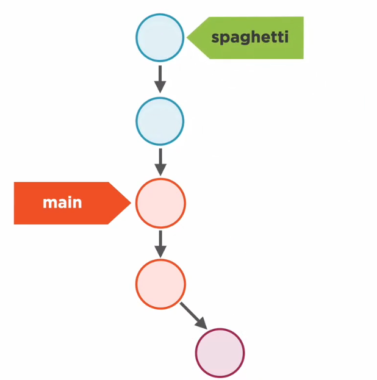

# Rebasing Made Simple

Rebasing is pretty rare feature in version control systems, it is one of Git's key features.

## What a Rebase Looks Like

Rebase is a nice way to keep our branches linear, it works by using the last common commit between two branches and moving one as the others base, this branch will have all the commits the other banch had.In practice, let's supose we had another branch called spagetti like so.


In this spagetti branch we will rebase the main branch, this is pretty similar to a merge operation. Let's first check the main branch's log.

```
 git log
commit 35e20aaa8a510a9503363501cf47a23c4a5f3b9d (HEAD -> master)
Author: Je12emy <Jeremyzelaya@hotmail.es>
Date:   Wed Aug 11 14:58:36 2021 -0600

    Added fish soup recipe

commit 6d636070c2642dfb821a6bf24173578b6293258d (ideas)
Merge: 7743c55 c023b15
Author: Je12emy <Jeremyzelaya@hotmail.es>
Date:   Wed Aug 11 12:42:57 2021 -0600

    Merge branch 'ideas'
```

Compare it too the branch spagetti's log.

```
git log
commit 5496293cf65feeabddeb72359a3b466efc3fbedc (HEAD -> spagetti)
Author: Je12emy <Jeremyzelaya@hotmail.es>
Date:   Wed Aug 11 14:55:08 2021 -0600

    Added new spagetti recipe

commit 6d636070c2642dfb821a6bf24173578b6293258d (ideas, master)
Merge: 7743c55 c023b15
Author: Je12emy <Jeremyzelaya@hotmail.es>
Date:   Wed Aug 11 12:42:57 2021 -0600

    Merge branch 'ideas'
```

Notice how both share  a common parent, when we rebase the branch master into the spagetti branch, it's commits will be moved between spagetti's latest commits and their last common commit.

```
git rebase master
```

After fixing some merge conflicts this is the new log for the spagetti branch.

```
git log
commit 5496293cf65feeabddeb72359a3b466efc3fbedc (HEAD -> spagetti)
Author: Je12emy <Jeremyzelaya@hotmail.es>
Date:   Wed Aug 11 14:55:08 2021 -0600

    Added new spagetti recipe

commit 35e20aaa8a510a9503363501cf47a23c4a5f3b9d (master)
Author: Je12emy <Jeremyzelaya@hotmail.es>
Date:   Wed Aug 11 14:58:36 2021 -0600

    Added fish soup recipe

commit 6d636070c2642dfb821a6bf24173578b6293258d (ideas)
Merge: 7743c55 c023b15
Author: Je12emy <Jeremyzelaya@hotmail.es>
Date:   Wed Aug 11 12:42:57 2021 -0600

    Merge branch 'ideas'
```

Notice how it now has the main branch's commits, if we switch into the master branch we could eidther rebase or merge (it would produce the same result), a Fast Forward would be used.

```
git log
commit 5496293cf65feeabddeb72359a3b466efc3fbedc (HEAD -> master, spagetti)
Author: Je12emy <Jeremyzelaya@hotmail.es>
Date:   Wed Aug 11 14:55:08 2021 -0600

    Added new spagetti recipe

commit 35e20aaa8a510a9503363501cf47a23c4a5f3b9d
Author: Je12emy <Jeremyzelaya@hotmail.es>
Date:   Wed Aug 11 14:58:36 2021 -0600

    Added fish soup recipe

commit 6d636070c2642dfb821a6bf24173578b6293258d (ideas)
Merge: 7743c55 c023b15
Author: Je12emy <Jeremyzelaya@hotmail.es>
Date:   Wed Aug 11 12:42:57 2021 -0600

    Merge branch 'ideas'
```

Rebase allows our branches to follow a really nice linear structure, instead of two branches merging at several states, this is how it looks like in a diagram.



And after a fast forward we have the following, notice how both branches are linear.


## An Illusion of Movement

Rebasing gives an illusion of movement, Git can't literally detach a branch and change it's parent commits, but rather it will generate new commits with mostly the same data and hash and only the parent commits will be altered. This is something to keep in mind in future rebase operations.

## Taking Out the Garbage

When coppying data for a new rebase, the old branch commits are not usefull and no branch is pointing to them, this makes them unaccesible. This means Git will clean them out to save space, this is pretty much the same process as detached heads.

> Git garbage-collects unreachable objects.

## The Trade-offs of Merges

Merges maintain History, the problem is that this history may get messy overtime, which is why viewring a project's history may be tricky in git history vualization tools and `git log` does not show this merges, it squashes the history in a linear fashion.

## The Trade-offs of Rebases

A rebase history is pretty simple, since commits are squashed in a linear fashion. This allows the project timeline to be really slick, the problem is that this history is rather forged by rebasing which creates new commits and leaves behind old commits to be garbage collected.

> Rebases refractor history.

A rebase history may look cleaner, but it's a lie. Though it may look like certain commits where made before other commits, they where probably made in parallel, where in contrast the merge shows the real history. There are certain commands which may become less usefull when we alter our project history and most importantly when this history rewrite may become painfull when we talk about distribution.

> When in doubt, just merge.

Rebase is a nice tool, but we should just use it when we understand the consequences.

## Tags in Brief

Let's talk about tags, to finish off the types of objects in a Git model there are Annotated Tags. A tag is like a label for a commit, say a official release on a specific commit. Anotated tags create a object in the `object Database` which contains meta-data like any other objects.

```
git tag release_1 -a -m "First cookbook release"
```

If we check the log, the tag is displayed.

```
git log
commit 5496293cf65feeabddeb72359a3b466efc3fbedc (HEAD -> master, tag: release_1, spagetti)
Author: Je12emy <Jeremyzelaya@hotmail.es>
Date:   Wed Aug 11 14:55:08 2021 -0600

    Added new spagetti recipe
```

We can check the tags simply with the following command.

```
git tag
release_1
```

Let's check the object created, annotated tags are so similar to branches that they are stores in a adyacent folder.

```
.
├── heads
│   ├── ideas
│   ├── master
│   ├── notgood
│   └── spagetti
└── tags
    └── release_1
```

This files hold meta-data for a specific commit.

```
git cat-file tags/release_1 -t
tag

git cat-file tags/release_1 -p
object 5496293cf65feeabddeb72359a3b466efc3fbedc <-- Hash for a commit
type commit
tag release_1
tagger Je12emy <Jeremyzelaya@hotmail.es> 1628718772 -0600

First cookbook release
```

Light tags on the other hand do not hold this kind of meta-data they only store the hash for a commit, they are created with the same command withouth the `-a` flag.

```
git tag Spicy_food_release

tree .
.
├── heads
│   ├── ideas
│   ├── master
│   ├── notgood
│   └── spagetti
└── tags
    ├── release_1
    └── Spicy_food_release <-- Light Tag

2 directories, 6 files
```

If we read it's content we will simply find a pointer to another commit.

```
cat tags/Spicy_food_release
5496293cf65feeabddeb72359a3b466efc3fbedc
```

We can also checkout to a specific tag.

> A tag is like a branch that doesn't move.
