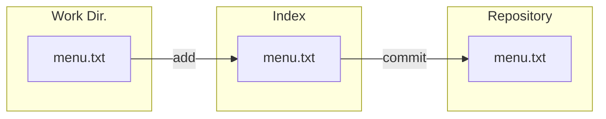

# The Four Areas: Basic Workflow

In the [[Introduction to the Four Areas#Introducing the Four Areas|last lesson]], we talked about the two basic questions we should ask to understand how any git command works. In this module we will dive deeper into the basic commands for our git flow like checkout, moving and renaming files.

## Moving Data to the Right

With commands such as `git add` and `git commit` we are able to move data from the Working Directory, into the Index and finally into the Repository.

When we make changes to any file in the working directory and use git status, we will be notified the working directory and index do not hold the same files.

```
git status
On branch master
Changes not staged for commit:
  (use "git add <file>..." to update what will be committed)
  (use "git restore <file>..." to discard changes in working directory)
	modified:   menu.txt

no changes added to commit (use "git add" and/or "git commit -a")
```

The diff will show us how they differ.

```
git diff
diff --git a/menu.txt b/menu.txt
index 485b728..521cbcf 100644
--- a/menu.txt
+++ b/menu.txt
@@ -2,3 +2,4 @@ Apple Pie
 Cheese Cake
 Fish Soup
 Spagetti
+Rice
```

With the `git add` command we will move these changes into the index.

```
git add menu.txt
```

If we check the status yet again, we will be notified the Repository does not hold the same files as the index.

```
git status
On branch master
Changes to be committed:
  (use "git restore --staged <file>..." to unstage)
	modified:   menu.txt
```

With the `git commit` command we will move this files into the Repository and all 3 areas will hold the same data.

```
git commit -m "Rice"
[master 5b8f8ef] Rice
 1 file changed, 1 insertion(+)
```

```
git status
On branch master
nothing to commit, working tree clean
```

This is how it looks like.



For all this steps we can check how each differs with the `git diff`command.

## Moving Data to the Left

One command to move data to the left is `git checkout` which moves the HEAD into another commit or branch, this will change the files in the repository and copy them over into the index and the working directory. 

## Removing Files

If we where to move files from the working area into the index, we can use the command `git rm` though it doesn't quite just do this. When we use the `git rm` command it will by default remove the file from both the index and the working directory, this is pretty destructive and git will warn us, if this is what we whant to accomplish then we can force this operation with `git rm <file_name> -f`. To actually remove a file from the Index area we need to provide the `--cached` flag, which will remove a file from the Index area.

> git rm is not the opposite of "git add"

## Renaming Files

Moving and Renaming files is pretty much the samething, when we rename a file Git will think we actually removed it and added a new file.


```
git status
On branch master
Changes not staged for commit:
  (use "git add/rm <file>..." to update what will be committed)
  (use "git restore <file>..." to discard changes in working directory)
	deleted:    menu.txt

Untracked files:
  (use "git add <file>..." to include in what will be committed)
	menu.md

no changes added to commit (use "git add" and/or "git commit -a")
```

In order to let Git know this is the same file, we need to add the new file and the old file, then Git will compare the contents of both files and fill figure out the file was just renamed.


```
git add menu.md menu.txt

git status
On branch master
Changes to be committed:
  (use "git restore --staged <file>..." to unstage)
	renamed:    menu.txt -> menu.md
```
