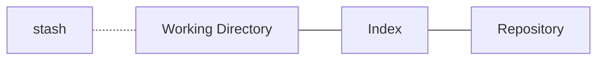

[#](#) The Four Areas: Introduction

We will revisit the way Git thinks in this module, not on technical features. This is what we did in the preivous course [[how_git_works/How_Git_Works]].

## Note About the CLI

This course used Linux commands since the instructor is using a MacOs terminal.

## Introducing the Four Areas

A Git project stores information in four basic areas.

- The Working Area, where we keep our files.
- The Repository, which contains the entire history.
- The Index, which is where we put our files before any commit.
- The Stash, the temporary storage area.

If we want to understand any Git command, we need to ask ourselved two basic questions.

* How does this command move information across the Four Areas?
* What does this command do to the repository?

It doesn't matter what any command is, if you can anwser this questions, then you will undestand it.

## The Working Area

Let's talk about the working area and repository area first, the working areas is where we add our files, changes ocur in the working areas. Git doesn't care about the working area, unless we commit changes.

## The Repository

This area is stored in the `.git` directory, where we find the `Object database` which stores created objects managed by Git. In here commits points to trees, blobs and other commits, which is how we get snapshots for our projects history. Branches simply point to a specific commit which in turn points to other commits to form a history.

## The Index

The index is pretty unique to Git, the index stands between the working area and the repository. It is also known as the stagging area, where we stage the changes from the working area and then commit them into the repository area. We will find the index in the `.git` directory, think of the index as another area which holds everything like the working area. When we use `git status` and Git informs us that there is nothing to cmmit, this means the index holds the same files and folders as the repository. 

The `git diff` commands provides the differences between two areas, with no arguments it will provide the diferences between the working area and the index. With the flag `--cached`, `git diff` will provide the differences between the index and the repository.

